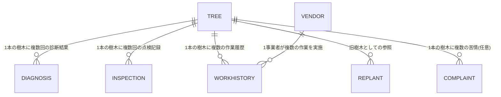

# (仮称)樹木管理システム 構築プロジェクト

> 港区の公募型プロポーザル仕様書をベースにした、Power Platform(Dataverse)によるフルスクラッチ相当の個人ポートフォリオ

## 概要

東京都港区が公表した「(仮称)樹木管理システム構築業務委託」の公募資料(仕様書・機能要件表・非機能要件表)を教材として、実在の自治体調達仕様に基づいた業務システムを個人で設計・構築したプロジェクトです。実際の港区案件への提出物ではなく、公開情報を参考にした学習・ポートフォリオ目的の制作物です。

## 主な実績(自動集計)

- テーブル数: 7
- 列数(合計): 78
- セキュリティロール数: 5(＋組み込みのシステム管理者)
- 付与した権限数(合計): 95

## 技術スタック

- Microsoft Power Platform (Power Apps / Dataverse / Power Automate)
- Dataverse Web API (REST) によるテーブル・セキュリティロールのコード管理(Infrastructure as Code)
- Power Automate クラウドフローによるテーブル横断の業務ロジック自動化
- Python (msal, requests) による自動構築・自動検証スクリプト
- Microsoft Entra ID による認証・多要素認証
- Excel(openpyxl) による要件マッピング・設計ドキュメントの自動生成

## データモデル(ER図)

凡例(テーブル論理名 → 表示名):
- `TREE` = 樹木マスタ
- `DIAGNOSIS` = 樹木診断結果
- `INSPECTION` = 点検記録
- `VENDOR` = 委託業者・協定管理者マスタ
- `WORKHISTORY` = 作業履歴
- `REPLANT` = 植替え履歴
- `COMPLAINT` = 苦情・陳情記録

## テーブル定義

### 樹木マスタ (`tree`)

列数: 18件

| # | 列名 |
|---|---|
| 1 | 樹木番号 |
| 2 | 路線番号 |
| 3 | 住居表示 |
| 4 | 樹高(m) |
| 5 | 幹周(cm) |
| 6 | 枝張(m) |
| 7 | 備考 |
| 8 | 樹種 |
| 9 | 常緑落葉区分 |
| 10 | 樹木区分 |
| 11 | 現在の健全度 |
| 12 | ステータス |
| 13 | 植樹年月日 |
| 14 | 支柱の有無 |
| 15 | 管理札の有無 |
| 16 | 緯度 |
| 17 | 経度 |
| 18 | 植替え前樹木ID |

### 樹木診断結果 (`diagnosis`)

列数: 16件

| # | 列名 |
|---|---|
| 1 | 診断記録番号 |
| 2 | 診断日 |
| 3 | 樹木医名 |
| 4 | 樹勢(活力診断) |
| 5 | 樹形(活力診断) |
| 6 | 根元_腐朽空洞等所見 |
| 7 | 幹_腐朽空洞等所見 |
| 8 | 大枝_腐朽空洞等所見 |
| 9 | 外観診断判定 |
| 10 | 総合判定 |
| 11 | 判定理由 |
| 12 | 次回診断予定時期 |
| 13 | 精密診断要否 |
| 14 | 精密診断_腐朽空洞率(%) |
| 15 | 診断カルテ添付ファイル |
| 16 | 樹木ID |

### 点検記録 (`inspection`)

列数: 20件

| # | 列名 |
|---|---|
| 1 | 点検記録番号 |
| 2 | 点検日 |
| 3 | 点検者 |
| 4 | 建築限界越え_車道側 |
| 5 | 建築限界越え_歩道側 |
| 6 | 道路施設との競合 |
| 7 | 支柱直し撤去 |
| 8 | 太枝枯れ折れ |
| 9 | 根上がり舗装クラック |
| 10 | 葉の状態異常 |
| 11 | 先端枝の枯れ |
| 12 | 枯死著しい衰弱 |
| 13 | キノコの有無 |
| 14 | 樹皮枯死欠損腐朽 |
| 15 | 病虫害 |
| 16 | 揺れ |
| 17 | 不自然な傾斜 |
| 18 | 点検結果 |
| 19 | その他特記事項 |
| 20 | 樹木ID |

### 委託業者・協定管理者マスタ (`vendor`)

列数: 4件

| # | 列名 |
|---|---|
| 1 | 事業者名 |
| 2 | 区分 |
| 3 | 担当路線・エリア |
| 4 | 連絡先 |

### 作業履歴 (`workhistory`)

列数: 7件

| # | 列名 |
|---|---|
| 1 | 作業記録番号 |
| 2 | 作業種別 |
| 3 | 作業日 |
| 4 | 実施者区分 |
| 5 | 作業内容メモ |
| 6 | 樹木ID |
| 7 | 実施事業者 |

### 植替え履歴 (`replant`)

列数: 5件

| # | 列名 |
|---|---|
| 1 | 植替え記録番号 |
| 2 | 植替え日 |
| 3 | 経緯・備考 |
| 4 | 旧樹木ID |
| 5 | 新樹木ID |

### 苦情・陳情記録 (`complaint`)

列数: 8件

| # | 列名 |
|---|---|
| 1 | 苦情記録番号 |
| 2 | 路線番号 |
| 3 | 依頼日 |
| 4 | 依頼内容 |
| 5 | 対応日 |
| 6 | 対応記録 |
| 7 | ステータス |
| 8 | 樹木ID |

## セキュリティロール権限マトリクス

| テーブル \ ロール | 各所管理者 | 区一般職員 | 街路樹管理委託事業者 | 協定管理者 | その他(閲覧専用) |
|---|---|---|---|---|---|
| tree | CRU(組織全体) | CRU(組織全体) | RU(担当エリア(BU)) | R(担当エリア(BU)) | R(組織全体) |
| diagnosis | CRU(組織全体) | R(組織全体) | R(担当エリア(BU)) | R(担当エリア(BU)) | R(組織全体) |
| inspection | CRU(組織全体) | CRU(組織全体) | CRU(担当エリア(BU)) | CR(担当エリア(BU)) | R(組織全体) |
| workhistory | CRU(組織全体) | CRU(組織全体) | CRU(担当エリア(BU)) | R(担当エリア(BU)) | R(組織全体) |
| replant | CRU(組織全体) | CRU(組織全体) | R(担当エリア(BU)) | R(担当エリア(BU)) | R(組織全体) |
| complaint | CRU(組織全体) | CRU(組織全体) | R(担当エリア(BU)) | R(担当エリア(BU)) | ― |
| vendor | CRU(組織全体) | R(組織全体) | R(自分のみ) | R(自分のみ) | ― |
凡例: C=作成 R=参照 U=更新 D=削除。「システム管理者」はDataverse組み込みロールで全テーブルにフルアクセスのため表から省略。

## ハーネス設計

### 構築ハーネス
dataverse_common.py に認証・テーブル/列作成・冪等性チェックを共通化し、各 create_xxx_table.py はスキーマの宣言だけで完結する構成。実行のたびに schema_manifest.json へ自己申告することで、実装と検証の情報源を一本化している。なお、Web API経由で作成した列はフォーム/ビューには自動反映されないため、UI上での動作確認時はフォームへの列追加が別途必要になる点を運用上の注意点として把握している。

### 検証ハーネス
verify_schema.py がschema_manifest.jsonを、verify_security_roles.pyがcreate_security_roles.pyの権限マトリクスを、それぞれ「期待値」としてDataverseの実際の状態と自動突合。手作業での目視確認を最小化している。

### ドキュメント生成ハーネス
本ドキュメント自体も、schema_manifest.json(データモデル)とcreate_security_roles.pyの権限マトリクス(セキュリティ設計)を単一の情報源として自動生成している。テーブルやロールを追加するたびに、このスクリプトを再実行するだけでREADME・資料が最新化される。

## 実装のハイライト

### Dataverseのテーブル・セキュリティロールを完全にコード化(Infrastructure as Code)
通常GUIで作成されることが多いDataverseのテーブル定義・セキュリティロールを、Web API呼び出しのPythonスクリプトとして実装。冪等性(何度実行しても安全)を持たせ、7テーブル・78列・6セキュリティロール・95権限をすべてコードから再現可能にした。

### 自己検証するインフラ構成(自己申告マニフェスト+自動検証ハーネス)
各構築スクリプトが実行結果を schema_manifest.json に自己申告し、検証スクリプトがそれを期待値としてDataverseの実状態と突合する設計。目視確認に頼らず、コマンド一発でテーブル・権限の整合性を保証できる。

### 自治体調達仕様の要件定義を、アーキテクチャ選定・コスト試算まで一貫して実施
機能要件表35項目・非機能要件表44項目を複数のアーキテクチャ候補(専用SaaS/汎用GIS+ローコード/Azure/AWSのマネージドサービス)と突き合わせて評価し、実装方針を選定。Power Platformライセンス費用も利用規模に応じて試算した。

### テーブル横断の業務ロジックをPower Automateで自動化し、実際の因果関係で検証
「樹木診断結果が登録されると樹木マスタの健全度が自動更新される」「植替え履歴が登録されると旧樹木のステータスが『植替え済』に自動更新される」という2本のテーブル横断ロジックをPower Automateクラウドフローで実装。1本目の実装時に「値は正しく更新されているのに画面上は確認できない」という事象に直面したが、憶測で修正せず実行履歴のエラーログを確認して原因(APIで作成した列はフォームに自動反映されない、トリガー条件と実際の操作の不一致)を特定。その知見を2本目の実装に活かし、事前にフォーム側の準備を整えることで一度のテストで正常動作を確認できた。

### API自動化とGUI操作を、対象の性質に応じて使い分け
テーブル定義やセキュリティロールなど宣言的でスキーマが明確な部分はWeb API+Pythonでコード化する一方、セキュリティロールの権限マッピングやモデル駆動型アプリ、Power Automateフローのように定義が複雑でGUIでの作成が実務上標準的な部分は、素直にPower Apps上で構築。「何でも自動化する」のではなく、対象ごとに適切な手段を選ぶ判断を行った。

### 地図機能(Azure Maps PCFコントロール)の多層的な障害切り分け
樹木の位置をAzure Mapsで表示するPCFコントロールが「デプロイは成功するが地図が表示されない」状態に陥った際、憶測で修正せず、Dataverse Web APIへの直接クエリ(ビューへのコントロールのバインド状況)、Azure Maps REST APIへのキー直接テスト、ブラウザコンソールログの精読という3方向から原因を切り分けた。実際の原因は(1)feature-usage宣言の値が不正、(2)対象ビューが既定ビューでなかった、(3)PCFビルドツール(pcf-scripts)がnode_modules配下の既製バンドルまでBabelでトランスパイルし、Web Worker内のヘルパー関数が失われる、(4)コントロールのインスタンスがデータセットロードと連動して複数回作り直され、非同期処理のタイミング競合で再描画が反映されない、という4段階の複合要因だった。(3)の修正はnode_modules直下のファイルパッチのため npm install で失われる。そこで postinstall フック(fix-pcf-webpack.js)で自動再適用する仕組みを整備し、再現性を担保した。(4)は当初setTimeoutでの遅延を試みたが不十分と判明し、最終的にサブスクリプションキーをモジュールスコープでキャッシュする設計に変更して解消した。

### 地図からの新規登録・ドラッグ移動と、権限に基づく機能制御
機能要件の「地図」区分(#28〜#32)として、ポイントクリックでの詳細画面遷移、ドラッグによる位置修正、空き地クリックでの新規登録を実装した。「管理者アカウント」という要件を特定のロール名にハードコードせず、context.utils.hasEntityPrivilege()でDataverseの実際の更新/作成権限を判定する設計にし、セキュリティロールの構成が変わってもコード変更が不要になるようにした。実装過程で2つの追加不具合を発見・修正している。1つ目はドラッグ操作が地図全体のパン操作と競合する問題で、mousedown時点ではなくポイントにマウスが乗った時点で先にパン操作を無効化する方式に変更して解消した。2つ目は新規登録した樹木が地図に反映されない問題で、原因調査のためビューのFetchXMLとDataverse上の実データを直接確認したところ、データ自体もビューの絞り込み条件も正常だった。最終的にPCFのpaging.setPageSize(500)が初回ロードのタイミングに間に合わず、既定のページサイズで打ち切られていたことが判明し(300件中の一部しか表示されていなかった)、hasNextPageを見ながらloadNextPage()を呼び続けて全件読み込む実装に変更して解消した。

### MFA・監査ログ設定を、憶測ではなく実環境の確認・操作で裏付け
非機能要件のMFA(多要素認証)は、Microsoft Entra管理センターで確認したところ「セキュリティの既定値群」が既に有効で、テナント全体に最初から適用されていたことが判明した(未設定と誤って評価していたものを訂正)。Dataverse監査ログは、組織全体の設定はWeb API(organizations.isauditenabled)で有効化できたが、テーブル単位の監査(IsAuditEnabled)はWeb API v9.2経由の更新が"Operation not supported on EntityMetadata"で一貫して失敗し、複数のペイロード形式を試した末にPower Appsの管理画面(テーブル設定 > 詳細オプション)から手動で有効化する方針に切り替えた。最終的にAPIで両方の設定値を直接取得し、実際に有効化されていることを確認した。

### バックアップ復元・負荷テストを、書類ではなく実際の操作で検証
非機能要件の裏付けとして、文書作成に頼らずまず実際に手を動かす方針で進めた。バックアップは pac admin backup で手動作成し、pac admin restore で復元コマンドを実行、「作成直後の手動バックアップは復元可能になるまで時間を要する」という仕様上の制約を実際のエラーメッセージから確認した(新環境への復元も試みたが、テナント側のリージョン指定制約により断念し、同一環境への復元に切り替えて検証)。ポイントインタイム復元については pac admin list で環境種別が Developer であることを確認し、本番相当環境限定の機能であるため利用不可であることをドキュメントの記載通り実証した。負荷テストは、JMeterの代わりに concurrent.futures による疑似10並列アクセスをDataverse Web APIに対して実施し、100リクエスト全て成功・平均応答624ms・95パーセンタイル728msという実測値を得た。

### 文書系成果物も、README・one_pagerと同じ「生成ハーネス」の思想で作成
テスト計画書・実施結果報告書、運用・障害対応手順書、簡易マニュアル、セキュリティ設計方針書の4文書を、generate_docs.pyと同様にPythonスクリプト(python-docx)から生成する方式で作成した。単なる体裁だけのテンプレート文書にせず、テスト計画書には本セッションで実際に発見・修正した17件の不具合・テスト結果をそのまま記録し、運用手順書には実際に作成した検証スクリプト群(verify_schema.py等)を定期点検ツールとして位置づけるなど、コードと文書の内容を一致させることを重視した。

## 仕様書要件に対する実装進捗

(2026-08-28時点、コードベースとの突き合わせによる評価)

### 機能要件(35項目)
- 実装済み(標準機能で充足含む): 22件
- 一部実装/仕様と差異あり: 3件
- 未着手: 6件
- 要確認(コードからは判断不可): 4件

### 非機能要件(44項目)
- 実装済み(標準機能で充足含む): 36件
- 未着手(主に文書系成果物): 2件
- 要確認(設定状況等、コードからは判断不可): 6件

### 主な未実装・要確認事項
- デモ協力者立会いのテスト(非機能要件#42)は、実際の協力者が必要なため未実施
- ポイントインタイム復元(非機能要件#39)はDeveloper環境のため利用不可(確認済み)

項目別の判定根拠: 機能要件_アーキテクチャ選定マッピング_v2.xlsx / 非機能要件_ポートフォリオ実装可否マッピング.xlsx の「実装状況」列に項目別の判定根拠を記録(2026-08-28時点のコードベースとの突き合わせ)

## セットアップ手順

1. pip install msal requests python-docx
2. Power Platform管理センターで環境のURLを確認
3. py create_tree_table.py など、各 create_xxx_table.py を順番に実行(初回のみ、以後は run_batch.py で一括実行可)
4. py create_security_roles.py でセキュリティロールを構築
5. py verify_schema.py / py verify_security_roles.py で整合性を検証
6. py generate_docs.py で本ドキュメントを最新化
7. py generate_test_report.py / generate_ops_manual.py / generate_user_manual.py / generate_security_policy.py で各種文書を生成(任意)

---

本プロジェクトは東京都港区が公表した公募資料を参考にした個人の学習・ポートフォリオ目的の制作物であり、港区への正式な提案書・提出物ではありません。

*このREADMEは generate_docs.py によって自動生成されています。手動で編集した内容は次回実行時に上書きされます。*
